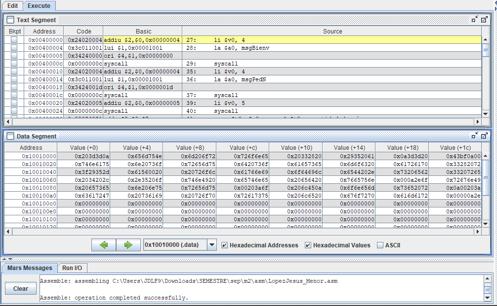

Laboratorio Assembler MIPS — UNIR  
Autor: Lopez, Jesus  
Asignatura: Estructura de Computadores  
Maestro: Deivis Eduard Ramirez Martinez  
Universidad: Fundación UNIR Colombia  
Entrega: Laboratorio #1 — Scripts en MIPS32

Descripción  
Este repositorio contiene tres scripts desarrollados en lenguaje ensamblador MIPS para el simulador MARS. Cada script realiza una operación distinta sobre números ingresados por consola:

LopezJesus_Mayor.asm: Calcula el número mayor entre N valores (N entre 3 y 5).  
LopezJesus_Menor.asm: Calcula el número menor entre N valores (N entre 3 y 5).  
LopezJesus_Fibonacci.asm: Genera los primeros K términos de la serie Fibonacci y muestra su suma total.  

Todos los scripts están comentados línea por línea, validados para entradas correctas, y listos para compilar y ejecutar.

Cómo ejecutar los scripts
1. Abre el simulador MARS.
2. Carga el archivo .asm correspondiente.
3. Ensambla el código (Assemble o F3).
4. Ejecuta el programa (Run o F5).
5. Ingresa los valores solicitados en la consola.

Estructura del repositorio

Laboratorio-Assembler/  
│  
├── LopezJesus_Fibonacci.asm  
├── LopezJesus_Mayor.asm  
├── LopezJesus_Menor.asm  
└── README.md

Mayor  
#Antes  

#Ejecuntado  

#Resultado  

Menor  
#Antes  

#Ejecuntado  

#Resultado  

Fibonacci  
#Antes  

#Ejecuntado  

#Resultado  

